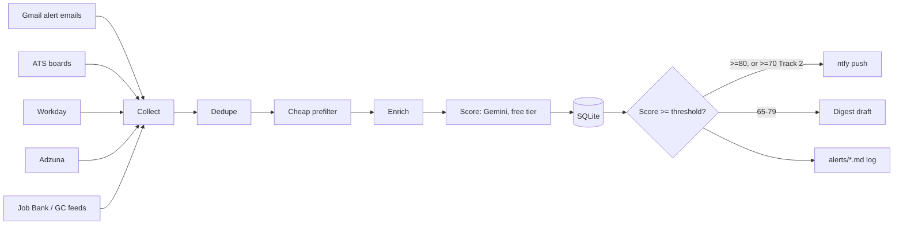

# Case Study: Building My Own Job Alert System (TEMPLATE)

**Do not fill this in until end of week one, and only with numbers the
logs actually show.** This file is a structure to write into, not a
draft to lightly edit -- every claim below needs a `runs`/`scores`/
`alerts` table query or a `logs/*.log` line behind it.

## The problem

<1 paragraph, first person: why I built this -- the early-applicant
advantage, the ToS constraint on scraping, wanting alerts within hours
not days.>

## My role

I specified the requirements, the hard filters, the four target tracks,
and the 0-100 scoring rubric (in `briefing.txt`, not shared publicly).
I reviewed and approved the pipeline design, the guardrails, and the test
results before anything ran on a schedule. Claude Code generated,
tested, and iterated on the code against those specifications.

## Approach

<1-2 paragraphs: sources chosen and why (link ADR-001), how scoring works
(link ADR-006 -- Gemini's free tier, and why it replaced the original
Claude-based design in ADR-002), what "alert" means at each tier.>

## Architecture



## Guardrails

<Link docs/adr/ADR-003-guardrails-and-safety.md; state which ones actually
triggered during week one, if any, with the log evidence.>

## Real results (week one)

Pull these from the database, don't estimate:

```bash
venv/bin/python -c "
import sys; sys.path.insert(0, 'src')
from jobalerts import db as dbmod
from jobalerts.config import get_settings
with dbmod.connect(get_settings()) as conn:
    runs = dbmod.recent_runs(conn, limit=100)
    print('runs:', len(runs))
    # postings collected/scored/alerted: sum counts_json across runs
    # applications / replies / interviews: query the applications table
"
```

- Postings collected: <N>
- Postings scored: <N>
- Alerts sent (A-tier immediate / B-tier digest): <N> / <N>
- Applications submitted (by Tommy, manually): <N>
- Replies / interviews: <N>
- Total cost this week: $<N> (cost per alert: $<N>)

## What went wrong and how it was fixed

<Be specific and honest -- e.g. an email-parsing heuristic that missed a
template variant, a source that tripped the circuit breaker, a prefilter
false-negative. Link the log line or commit that fixed it.>

## Limits

<What this system does not do: doesn't apply for you, doesn't cover every
possible source (Job Bank/GC feed is off until a real endpoint is
confirmed -- ADR-001), email-alert parsing is best-effort against
templates that can change, scoring quality is bounded by how well
briefing.txt is written.>
